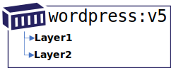
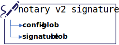
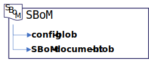
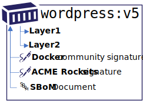
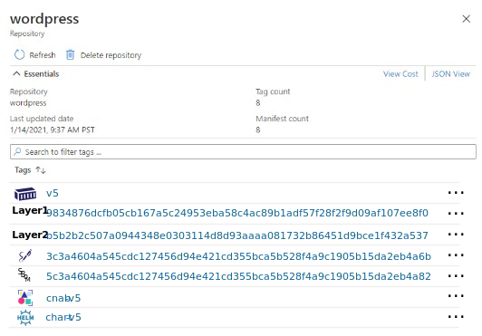
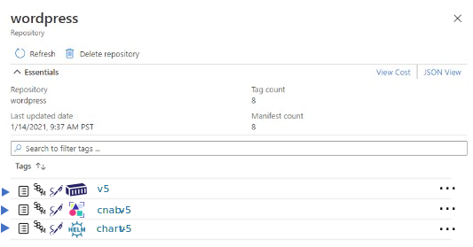
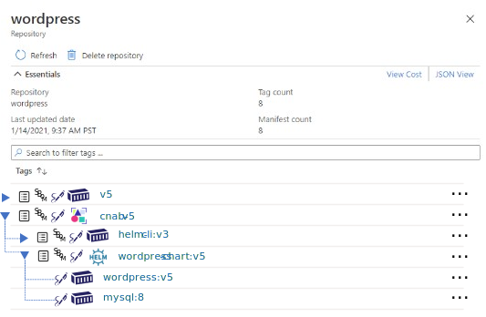
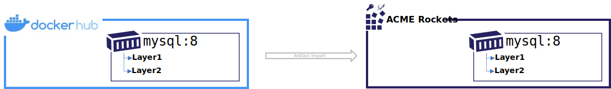
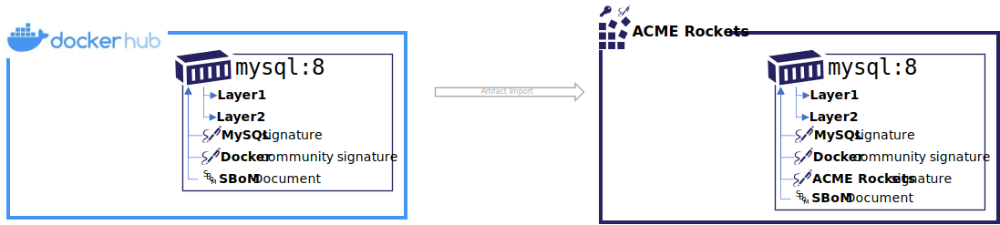

# OCI Artifact Manifest

The OCI artifact manifest provides a means to define a wide range of artifacts, including a chain of dependencies of related artifacts. It provides a means to define artifacts that are independent, or enhance other artifact types.

These collections provide the information required for:

- validating an artifact
- registry management and visualizations
- deletion management, including reference counting and garbage collection
- indexing for artifact discover, along with it's related content
- copying within & across registries

## Design Points

OCI Artifact Manifest has the following design points:

### Artifacts Move Within & Between Registries

Artifact will move from dev, through test, to staging. They'll continue movement to a distribution point or deployment. Throughout the process an artifact may move to other repositories within a registry or across different registries.

Content movement within a registry:

```bash
registry.acme-rockets.io\
  dev\
    web-image:v1
    web-image:v2
    web-image:v3
    web-deploy:v1
    web-deploy:v2
    web-deploy:v3
  staging\
    web-image:v2
    web-image:v3
    web-deploy:v2
    web-deploy:v3
  prod\
    web-image:v2
    web-deploy:v2
```

Content movement across registries:

```bash
dev-registry.acme-rockets.io\
  web-image:v1
  web-image:v2
  web-image:v3
  web-deploy:v1
  web-deploy:v2
  web-deploy:v3
```

```bash
prod-registry.acme-rockets.io\
  web-image:v2
  web-deploy:v2
```

Content published for public consumption

```bash
products.wabbit-networks.io\
  net-monitor:v1
  net-monitor:v2
  net-monitor-charts:v1
```

To support artifact movement, the content that constitutes an artifact to individually represent itself must be maintained within the same registry. For example, the layers of an container image, or the signature blob of a Notary v2 signature artifact.

### Dependencies on Blobs and Other Artifacts

A class of of artifacts will have content (blobs) that represent the artifact (eg: Notary, SBoM), however they are extensions of another artifact (eg: container image) which are dependencies on other `manifests`. The other manifests could be any OCI supported manifest, including `image-manifest`, `image-index` and other `oci.artifact.manifest` references.

All extension artifacts are stored without tags, and must be stored in the same repository as the artifact they are extending.

## Supported Artifact Types

Artifact manifest is intended to support the following artifact types:

### OCI Image

An OCI Image is based on the oci-image-manifest. It's shown as a comparison to the examples below that may depend upon, or reference OCI images. Note: all references below may be made to oci-index as well as oci-manifest.



### Notary v2 Signatures and SBoM Persistance

A Notary v2 signature, or an SBoM document would persist as a manifest with a config object and a signature, persisted as a blob. However, neither the signature, nor the SBoM have value unto themselves. A signature and SBoM extend a given artifact. They're considered as dependent upon another artifact to be complete.





The Notary v2 signature and SBoM would reference an artifact, such as the `wordpress:v5` image above. Notice the directionality of the references. One or more signatures may be added to a registry after the image was persisted. While an image knows of it's layers, and a Notary v2 signature knows of its config and blob, the Notary v2 signature declares a dependency to the artifact it's signing. The visualization indicates the references through solid lines as these reference types are said to be hard references. Just as the layers of an OCI Image are deleted (*ref-counted -1*), the blobs of a signature are deleted (*ref-counted -1*) when the signature is deleted. Likewise, when an artifact is deleted, the signatures and SBoM would be deleted (*ref-counted -1*) as the signatures and SBoMs have no value without the artifact they are signing.



## Supported Scenarios

The main scenarios include:

1. Discovery of content within a registry for content listing through a CLI and visualizations.
1. Copying within and across registries, with the option to copy loose references, if resolved.
1. Deletion management, providing information to de-dupe content with reference counting, and the option to delete loose references.
1. Support enhancing information related to existing content. Such as adding a Notary v2 signature or SBoM artifacts.
1. Validation, with required and optional references.

### Content Discovery

Registries today support a flat list of content within designated repositories. A container image, multi-arch container image, Helm Chart, CNAB, Singularity, WASM and other OCI Artifact types can be listed based on their `manifest.config.mediaType`



In the above example, all the artifacts are displayed without relation to each other. The layers of the `:v5` are also displayed as an example of data that is already hidden.



In the above example, the Notary v2 signature, an SBoM and collection of attributes are displayed as directly associated with their primary artifact.



In the above case, the graph of references can be expanded showing the references across repositories. This visualization demonstrates the hierarchy known by the registry, based on the artifact-manifest. While an artifact icon is displayed, based on the `manifest.config.mediaType`, the registry need not know any of the artifact specific details to track this data. Registries would not need to parse the Helm Chart, the CNAB. Each artifact author will lift data elements for the objects they wish to reference in a registry.

### Copy Container Images



As a reference, copying a container from a public registry to a private registry would involve `docker pull`, `docker tag` and `docker push`

```bash
docker pull mysql:8
docker tag mysql:8 registry.acme-rockets.io/base-artifacts/mysql:8
docker push registry.acme-rockets.io/base-artifacts/mysql:8
```

The above commands account for the image manifest and the associated layers. Note the directionality of the manifest `-->` layers references. A manifest declares the layers that must be accounted for before a manifest may be considered valid within a registry. In addition, most registries implement layer de-duping and reference counting to avoid maintaining multiple copies of the same layers.

```json
{
  "schemaVersion": 2,
  "config": {
    "mediaType": "application/vnd.oci.image.config.v1+json",
    "size": 7097,
    "digest": "sha256:c8562eaf9d81c779cbfc318d6e01b8e6f86907f1d41233268a2ed83b2f34e748"
  },
  "layers": [
    {
      "mediaType": "application/vnd.oci.image.layer.v1.tar+gzip",
      "size": 27108069,
      "digest": "sha256:a076a628af6f7dcabc536bee373c0d9b48d9f0516788e64080c4e841746e6ce6"
    },
    {
      "mediaType": "application/vnd.oci.image.layer.v1.tar+gzip",
      "size": 1741,
      "digest": "sha256:f6c208f3f991dcbc417fed8efde391f887c0551d77ed0c1a125fd28f4841e1cc"
    }
  ]
}
```

### Container Image, with Signatures and an SBoM



In this scenario, Notary v2 signatures have been added. Note the directionality of the Notary v2 signatures references. The `mysql:8` image has no reference to the signatures. The signatures may be added to existing artifacts. The signatures declare a reference `-->` to the `mysql:8` image. This assures the `mysql:8` image tag and digest need not change to support signatures, nor SBoMs added throughout the secured supply chain.

From a user experience perspective, copying a container from a public registry to a private registry would likely be expected to copy the signatures alongside the artifact they've signed, as well as other extension artifacts like SBoMs.

The `oci.artifact.manifest` supports the Notary v2 and SBoM requirements, including:

- support for additive signatures, assuring the target manifest digest and tag do not change
- support for multiple signatures. In the above scenario, `mysql` signed the original image. As `mysql` was copied to Docker Hub, an additional `docker community signature` was added, providing certified content attestation. Once the image copy to ACME Rockets is completed, an additional `acme-rockets signature` is added providing assurance the `mysql:8` image was security scanned and verified it's applicable to the ACME Rockets environment.

From a user experience, the signature artifacts have no unique value beyond the artifact they represent, therefore they would be persisted to a registry in a form by which they are known to copy with the artifact, and be deleted when the artifact they are associated with is deleted.

To support hard references, an additional dependencies collection is added to a new `application/vnd.oci.artifact.manifest.v1+json` schema. The `manifests` collection declares the artifact the signature is dependent upon.

**A Notary v2 signature of the `mysql:8` image example:**

```json
{
  "schemaVersion": 1,
  "mediaType": "application/vnd.oci.artifact.manifest.v1+json",
  "artifactType": "application/vnd.cncf.notary.v2+json",
  "config": {
    "mediaType": "application/vnd.cncf.notary.config.v2+json",
    "digest": "sha256:b5b2b2c507a0944348e0303114d8d93aaaa081732b86451d9bce1f432a537bc7",
    "size": 102
  },
  "blobs": [
    {
      "mediaType": "application/tar",
      "digest": "sha256:9834876dcfb05cb167a5c24953eba58c4ac89b1adf57f28f2f9d09af107ee8f0",
      "size": 32654
    }
  ],
  "manifests": [
    {
      "mediaType": "application/vnd.oci.image.manifest.v1+json",
      "digest": "sha256:3c3a4604a545cdc127456d94e421cd355bca5b528f4a9c1905b15da2eb4a4c6b",
      "size": 16724
    }
  ],
  "annotations": {
    "org.cncf.notary.v2.signature.subject": "docker.io"
  }
}
```

In the above example, the signing entity is Docker, which is represented as a notary scoped annotation: `"org.cncf.notary.v2.signature.subject": "docker.io"`

#### OCI-Registry CLI

To copy the above image and the associated signatures, a new `oci-reg` cli is proposed for illustrative purposes. The `oci-reg` cli is an independent tool that demonstrates the value of these collections, providing a standard means for working within and across different OCI conformant registry implementations.

The following command would copy the `mysql:8` image from docker hub to the acme-rockets registry. The CLI _could_ be run within the source or target cloud eliminating the download/upload network hops.

```bash
oci-reg copy \
  --source docker.io/mysql:8 \
  --target registry.acme-rockets.io/base-artifacts/mysql:8
```

The `oci-reg copy` command would:

- assure the manifest and layer/blob digests remain the same
- copy any artifacts that are dependent on the source artifact-manifest, persisting them in the target registry. These _could_ include Notary v2 signatures, SBoMs, GPL source or other referenced artifacts.

### Deletion

Distribution-spec APIs will provide standard delete operations, including options for deleting referenced artifacts, or blocking a delete as the artifact is referenced by other artifacts. The `oci.artifact.manifest` collection will provide the information, as defined by the artifact author` for how an artifact should be handled for delete operations. The registry, nor the `oci-reg` cli would need to know about specific artifact implementations.

The deletion scenarios include:

- Which references should be deleted (ref counted)
- Which artifacts may be blocked from deletion as another artifact depends upon it.

- Examples:
  - deleting the wordpress helm chart deletes the config, chart and values blobs.
  - deleting the wordpress helm chart will reduce the ref-count of the images it may reference.
  - deleting the mysql image should warn if referenced by any helm charts. However, based on the parameters of the cli, it may delete images referenced by helm charts within the registry as these references are considered loose references and may be resolved externally to the registry.
  - deleting the wordpress helm chart, wordpress image, or mysql image would delete the associated signatures as the signatures have no value unto themselves. The `oci-reg` cli may accomplish these delete steps without any knowledge of Notary v2 spec as the `oci-reg` delete cli will follow the rules of the `oci.artifact.manifest` collections.

## OCI Artifact Collections

OCI Artifact Manifests provide the following types of references:

- **Blobs:** Content that represents the artifact. These are analogues to layers from the OCI Image manifest and Config objects. Layers are renamed blobs as they represent a generic collection of content, as opposed to an ordered layered collection as defined by OCI Image Manifest. An artifact may treat them as ordered, but it is not required.
- **Manifests** are dependent references to other artifacts that enhance the content, such as a Notary v2 signature or an SBoM. These dependencies are *unknown* by the original artifact as they are added at a later time. A registry would need to index these references as registry apis would request all content related to the source artifact.

### Blobs Collection

All `blobs` are considered to be hard dependencies that must be resolvable within a registry. An artifact is considered invalid if the manifest blobs are not resolvable. Registries MAY implement de-duping, using ref-counting to assure at least one copy of the blob is resolvable for any given `oci.artifact.manifest`. OCI Artifact blobs are generalizations of the OCI Image Spec layers definition.

### Manifests Collection

Alternate names:

- `dependent-upon`
- `parents`
- `enhances`

The `manifests` collection is an optional collection of references to other artifacts. The artifact is said to enhance the dependent artifacts by adding additional content. The content may be added after the initial content was created or pushed to a registry. By supporting additional content, the referenced artifact can be enhanced without having to change the referenced artifacts manifest, digest or tag.

Examples include:

- Notary v2 signatures
- SBoM documents
- Artifact Meta-data

`manifests` are collections of Content Descriptors.

## Annotations

OCI Artifact Manifest includes several annotations that have been generalized from the image-spec annotations.

- **`annotations`** *string-string map*

    This OPTIONAL property contains arbitrary metadata for the image manifest.
    This OPTIONAL property MUST use the [annotation rules](annotations.md#rules).

    See [Pre-Defined Annotation Keys](annotations.md#pre-defined-annotation-keys).

### Pre-Defined Annotation Keys

This specification defines the following annotation keys, intended for but not limited to  Artifact Manifest authors:

- **org.opencontainers.artifact.created** date and time on which the artifact was built (string, date-time as defined by [RFC 3339](https://tools.ietf.org/html/rfc3339#section-5.6)).
- **org.opencontainers.artifact.authors** contact details of the people or organization responsible for the artifact (freeform string)
- **org.opencontainers.artifact.url** URL to find more information on the artifact (string)
- **org.opencontainers.artifact.documentation** URL to get documentation on the artifact (string)
- **org.opencontainers.artifact.source** URL to get source code for building the artifact (string)
- **org.opencontainers.artifact.version** version of the packaged software
  - The version MAY match a label or tag in the source code repository
  - version MAY be [Semantic versioning-compatible](http://semver.org/)
- **org.opencontainers.artifact.revision** Source control revision identifier for the packaged software.
- **org.opencontainers.artifact.vendor** Name of the distributing entity, organization or individual.
- **org.opencontainers.artifact.title** Human-readable title of the artifact (string)
- **org.opencontainers.artifact.description** Human-readable description of the software packaged in the artifact (string)

```json
{
  "annotations": {
    "org.opencontainers.artifact.created": "",
    "org.opencontainers.artifact.authors": "",
    "org.opencontainers.artifact.url": "opencontainers.org",
    "org.opencontainers.artifact.documentation": "opencontainers.org",
    "org.opencontainers.artifact.source": "https://github.com/opencontainers/artifacts",
    "org.opencontainers.artifact.version": "v1.0",
    "org.opencontainers.artifact.revision": "v1.1.0",
    "org.opencontainers.artifact.vendor": "Open Containers Initiative",
    "org.opencontainers.artifact.licenses": "MIT",
    "org.opencontainers.artifact.title": "Open Containers Artifact Manifest",
    "org.opencontainers.artifact.description": "A schema for defining artifacts"
  }
}
```

## Open Questions

1. Should the references collection support additional types, like loose urls
